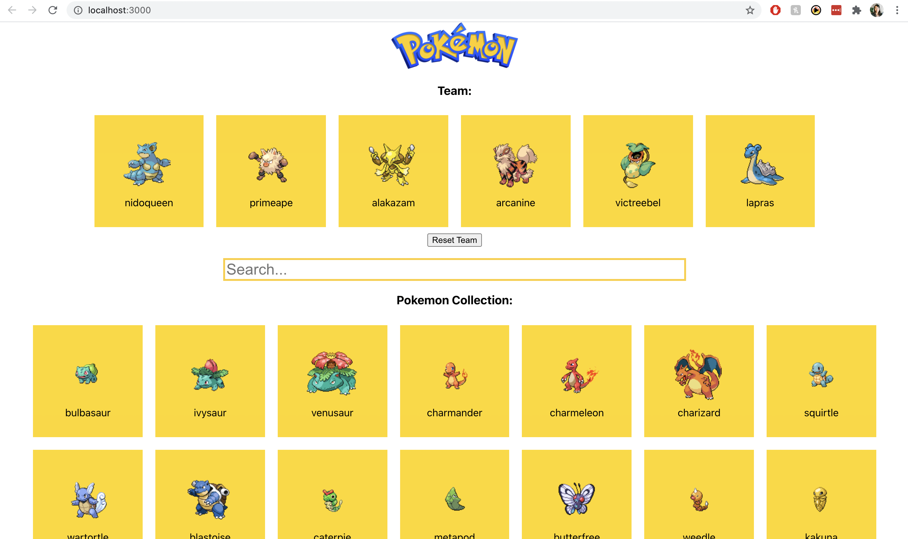

# [Thinking in React](https://reactjs.org/docs/thinking-in-react.html)

X. Start with a Mock
X. Break The UI Into A Component Hierarchy
X. Build A Static Version in React
X. Identify The Minimal (but complete) Representation Of UI State
X. Identify Where Your State Should Live
5. Add Inverse Data Flow

# State?
- In App: `myTeam` represents the 0-6 pokemon in our team; It is an array init to []
- In App: `allPokemon` represents all 150 pokemon PERIOT. It is an array init to [], then [150].
- In the App: `searchTerm` represents the text in the search; the pokemon we see in Pokemon Collection; 
    - It is a string init to ""

`const shownPokemon = allPokemon but filtered on the searchTerm minus the pokemon on our team`

App 
 |- Header
 |- Team
 |    |- Card ...   
 |- Searchbar
 |- PokemonCollection
      |- Card ...

# Features
X On load of the app, there is no team, but we all see pokemon in the collection
X Click on a pokmeon to add it to the team
X We can have a max of 6 pokemon on a team
X We cannot have duplicate pokemon on our team
- Click on a pokemon to remove it from the team
- Reset button will remove all pokemon in our team

Stretch features:
X Searchbar
